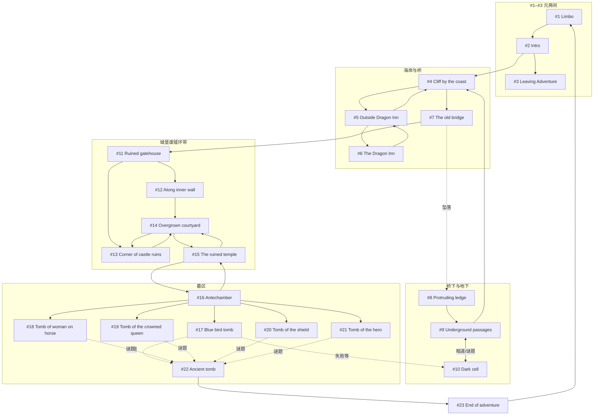

<!-- doc: tutorial-world-23-rooms-map.md | audience: agents, designers | lang: zh -->

# 教程世界 · 23 房间相对位置图

本文档描述与 **`docs/agents-room-icon-image-prompts-zh.md`** 一致的 **23 个房间** 在叙事空间中的**相对位置**与**连通关系**。编号 **#1–#23** 与该文档表格序号一致。空间隐喻以 Evennia `contrib.tutorials.tutorial_world.build` 内 ASCII 图为骨架，并补上 **Limbo** 与 Claw 侧 **Leaving Adventure / End of adventure** 命名。

**说明：**

- **几何方向**（西/东/南/北）为示意图，便于策划与 Agent 理解；**吊桥**为特殊房间，需多次 `east`/`west`，非一步出口。  
- **五座墓室**（#17–#21）在剧情上均由 **前室**（#16）进入，彼此不直连。  
- **db_key** 以当前快照为准（如 `Outside Dragon Inn` / `End of adventure`）。

---

## 1. 总览：编号与 db_key 对照

| # | db_key | 区域标签 |
|---|--------|----------|
| 1 | `Limbo` | 元·传送枢纽 |
| 2 | `Intro` | 元·教程入口 |
| 3 | `Leaving Adventure` | 元·提前结束 |
| 4 | `Cliff by the coast` | 海岸主线 |
| 5 | `Outside Dragon Inn` | 支线（崖上隐藏径） |
| 6 | `The Dragon Inn` | 支线（旅店内） |
| 7 | `The old bridge` | 海岸主线（桥） |
| 8 | `Protruding ledge` | 桥下/坠落 |
| 9 | `Underground passages` | 地下 |
| 10 | `Dark cell` | 地下/暗牢 |
| 11 | `Ruined gatehouse` | 城堡东门 |
| 12 | `Along inner wall` | 内墙巡逻带 |
| 13 | `Corner of castle ruins` | 城堡转角（方尖碑） |
| 14 | `Overgrown courtyard` | 庭院（幽灵巡逻） |
| 15 | `The ruined temple` | 神庙 |
| 16 | `Antechamber` | 地下前室 |
| 17 | `Blue bird tomb` | 墓室（传送谜题） |
| 18 | `Tomb of woman on horse` | 墓室 |
| 19 | `Tomb of the crowned queen` | 墓室 |
| 20 | `Tomb of the shield` | 墓室 |
| 21 | `Tomb of the hero` | 墓室 |
| 22 | `Ancient tomb` | 真墓/终点战斗前 |
| 23 | `End of adventure` | 元·通关结算 |

---

## 2. 主拓扑 ASCII 图（相对位置）

图中 `(#n)` 对应上表编号。`===` 表示吊桥上多步穿行（非单格）。

```
                          (#5 Outside Dragon Inn)──(#6 The Dragon Inn)
                                        │
                              (爬树解锁 north)
                                        │
                                        │
(#1 Limbo)──(#2 Intro)──(#4 Cliff by the coast)════════════════════════(#11 Ruined gatehouse)──(#13 Corner of castle ruins)
    ▲           │              │  ║                      │                      │
    │           │              │  ║                      │                      └──(#14 Overgrown courtyard)──(#15 The ruined temple)
    │           │              │  ║                      │                                      │
    │           │              │  ║                      └──(#12 Along inner wall)─────────────┘
    │           │              │  ║                                   │
    │           │              │  ║                                   └──(与庭院互通)
    │           │              │  ║
    │           │              └──(#8 Protruding ledge)──(#9 Underground passages)
    │           │                      │                         │
    │           │                      │                         └──(链梯)──回 (#4)
    │           │                      │
    │           │                      └──(#10 Dark cell)  ← 根墙谜题/失败传送等
    │           │
    │           └──(#3 Leaving Adventure)  （教程提前退出）
    │
    └────────────────────────────────────────────────────────────────────────────(#23 End of adventure)──(exit)──…
                                                                                        ▲
(#22 Ancient tomb)────────────────────────────────────────────────────────────────────┘
        ▲
        │
(#16 Antechamber)──┬──(#17 Blue bird tomb)
                   ├──(#18 Tomb of woman on horse)
                   ├──(#19 Tomb of the crowned queen)
                   ├──(#20 Tomb of the shield)
                   └──(#21 Tomb of the hero)
```

**读图要点：**

- **#1 Limbo** 不在 Evennia 批次 ASCII 内，但在逻辑上通过 **#23** 的出口、`#2` 的 `adventure` 入口与世界相连。  
- **#7 The old bridge** 占据 **#4** 与 **#11** 之间的「长条」空间；坠落至 **#8**，而非直接到 **#11**。  
- **#12 / #13 / #14 / #15** 构成城堡废墟 **巡逻区 + 庭院 + 神庙** 的环带（具体出口名称以游戏内 `exits` 为准）。  
- **#16** 在 **#15** 之下（楼梯）；**#17–#21** 为 **#16** 的五扇墓门；**#22** 为谜题正确时的传送目标；**#23** 接在 **#22** 通关流程之后。

---

## 3. Evennia 原版建造图（房间号对照）

以下为 `build.ev` 注释中的编号与 **本仓库 db_key** 的对应关系（便于对照源码）：

```
     ? tut#03,04  →  (#5)(#6) 支线
          |
+---+----+    +-------------------+    +--------+   +--------+
|   #4     |    |        #7         |    |  #11   |   |  #13   |
| cliff    +----+      bridge       +----+gate    +---+ corner |
| tut#02   |    |                   |    |        |   |        |
+---+----+    +---------------+---+    +---+----+   +---+----+
    |    \                    |            |  castle  |
    |     \  +--------+  +----+---+    +---+----+   +---+----+
    |      \ |   #9   |  |  #8   |    |  #12   +---+ #14    |
    |       \|under-  |  |ledge  |    | wall   |   |yard    |
    |        |ground  +--+ tut#06     | tut#10 +---+tut#12  |
    |        | tut#07 |  |        |    |        |   |        |
    |        +--------+  +--------+    +--------+   +---+----+
    |                \                                  |
   ++---------+       \  +--------+    +--------+   +---+----+
   |  #2      |        \ |  #10   |    | trap   |   | #15    |
   | intro    |         \| cell   +----+ (mob)  |   |temple  |
   | tut#01   |          | tut#08 |   /|        |   | tut#13 |
   |          |          |        |  / +--+--+--+   +---+----+
   +----+-----+          +--------+ /     | | |          |
        |                           /     | | |          |
   +----+-----+          +--------+/   +--+-+-+----------+----+
   |  #3      |          |  #22   |    |      #16        |
   | Leaving  |          |Ancient |    |  Antechamber    |
   | Adventure|          | tut#15 |    |      tut#14     |
   +----------+          +--------+    +-----------------+
```

**Limbo (#1)** 与 **End of adventure (#23)** 未画入上框：二者为 **元房间**，分别承担 **进入教程** 与 **结算回传**。

---

## 4. Mermaid：连通关系（逻辑图）

下列图为 **可通行关系**，不严格等价于地图上的欧氏距离。



虚线 `-.->` 表示 **传送或条件触发**，非普通 `exit` 一步到达；**墓室失败** 常回 **#10**（以实际批次逻辑为准）。

---

## 5. 与 Agents 资料页的说明

- **#1–#3** 与 **#23** 在公开 Agent 资料中可按产品规则 **排除在「到过的房间」计数之外**（见 `frontend/lib/agent-exploration.ts`）。  
- 拓扑与 **房间图标 basename** 的对应仍按 **`slugForProfileAsset(db_key)`** 与 `frontend/lib/agent-profile-display.ts` 中的 **`AGENT_PROFILE_ROOM_ORDER`** 维护。

---

## 6. 参考与修订

- Evennia：`contrib/tutorials/tutorial_world/build.ev` 注释地图与 `@dig` 顺序。  
- 仓库：`docs/evennia-tutorial-walkthrough.md`、`docs/world_snapshots/inventory.jsonl`（索引见 `docs/README.md`）。  
- 若世界重建导致 **db_key** 或 **出口** 变更，请同步更新 **本文第 2–4 节** 与 `AGENT_PROFILE_ROOM_ORDER`。
